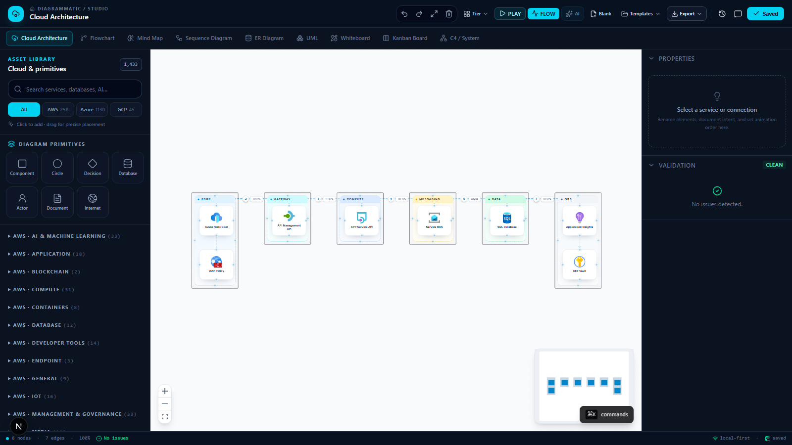
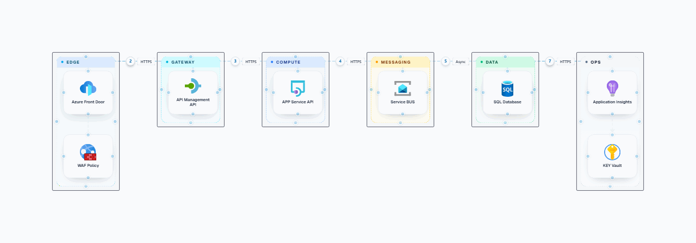
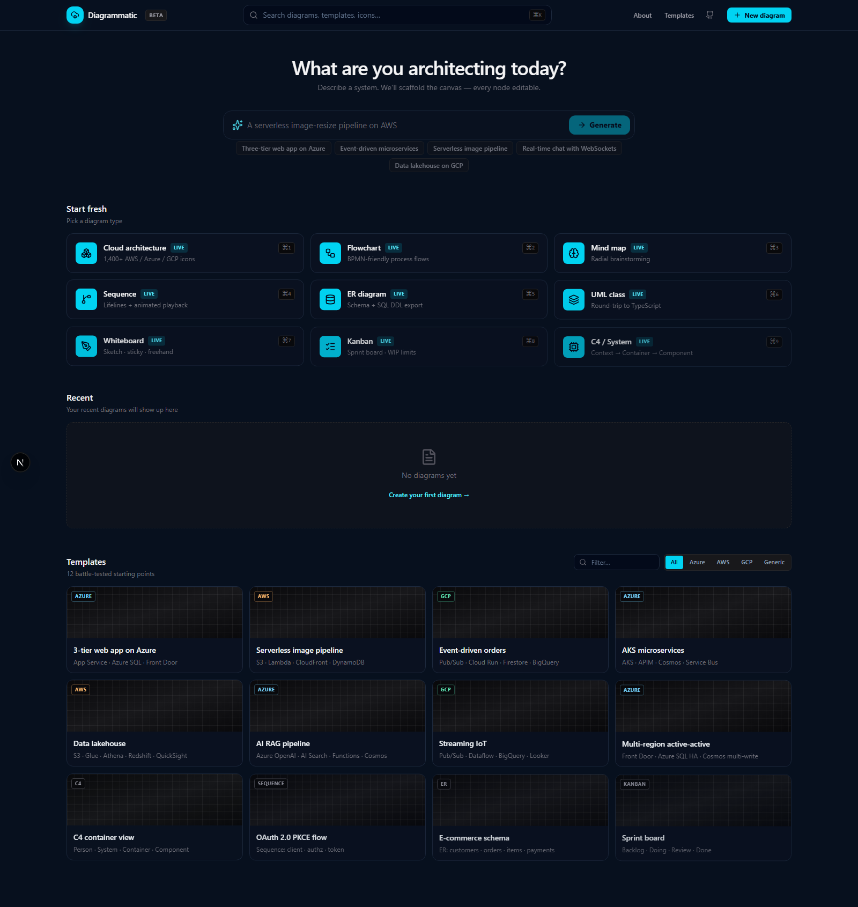
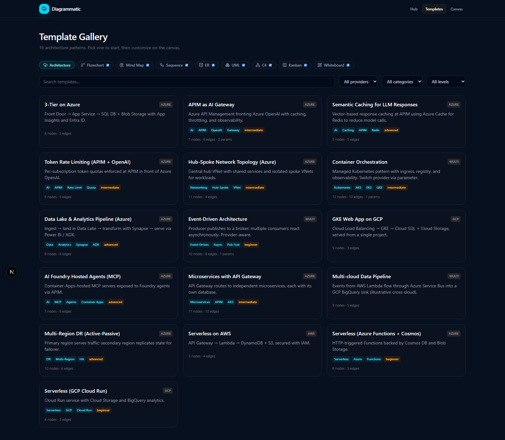
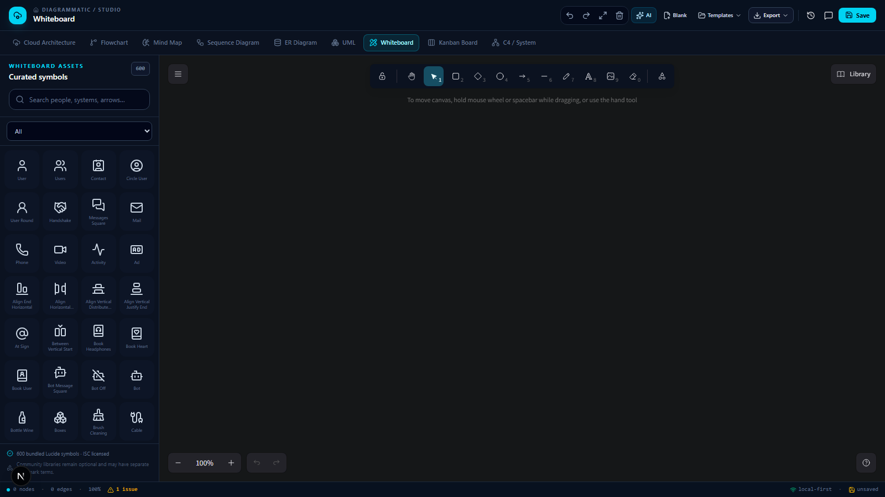
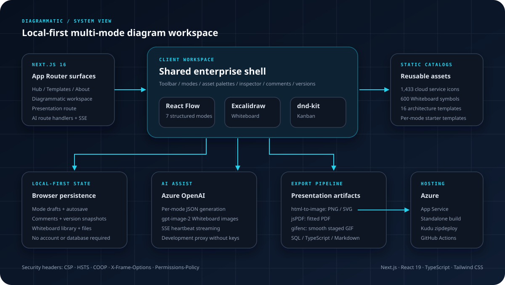

<p align="center">
  
</p>

<p align="center">
  <strong>Design enterprise cloud systems, explain request flows, and export presentation-ready diagrams from one local-first workspace.</strong>
</p>

<p align="center">
  <a href="https://architecture-playground.azurewebsites.net">Live demo</a>
  ·
  <a href="#demo-walkthrough">Watch demo</a>
  ·
  <a href="#application-screenshots">Screenshots</a>
  ·
  <a href="#architecture">Architecture</a>
  ·
  <a href="#run-locally">Run locally</a>
  ·
  <a href="#deploy-to-azure">Deploy to Azure</a>
</p>

<p align="center">
  
  
  
  
  
</p>

> The hosted demo is protected by a shared workspace credential. Local
> authentication is disabled by default. Diagrams, comments, and version
> snapshots stay in the browser unless you explicitly export them or submit
> content for AI review, conversion, or an Azure Portal handoff.

---

## What is Diagrammatic?

Diagrammatic is an open-source, browser-based diagram workspace built for cloud
architects, engineers, product teams, and technical storytellers. It combines
nine diagram modes behind one enterprise shell:

| Mode | Engine | Primary use |
| --- | --- | --- |
| Cloud Architecture | React Flow | Azure, AWS, GCP, and multi-cloud system design |
| Flowchart | React Flow | Processes, decisions, and operational flows |
| Mind Map | React Flow | Discovery, planning, and concept decomposition |
| Sequence Diagram | React Flow | Participant lifelines and message order |
| ER Diagram | React Flow | Entities, relationships, and SQL DDL |
| UML | React Flow | Classes, interfaces, and TypeScript export |
| C4 / System | React Flow | Person, system, container, and component views |
| Kanban | dnd-kit | Sprint planning, WIP limits, and Markdown export |
| Whiteboard | Embedded canvas | Freehand ideation, 600 bundled symbols, and AI images |

Cloud Architecture is the flagship experience. It includes **1,433 cloud service
icons**, generic architecture primitives, boundaries, reliable four-way
connections, explicit flow stages, validation, comments, versions, and smooth
animated GIF export.

## Why use it?

| Use case | What Diagrammatic provides |
| --- | --- |
| Architecture review | Clean boundaries, protocols, validation, and high-resolution PDF/PNG/SVG export |
| Executive walkthrough | Numbered request stages and smooth synchronized GIF motion |
| Multi-cloud design | Searchable Azure, AWS, and GCP service catalogs |
| Design workshop | Whiteboard drawing, 600 bundled symbols, and AI-assisted images |
| Engineering handoff | JSON round-trip plus SQL, TypeScript, and Markdown exports |
| Rapid scaffolding | Enterprise templates, deterministic prompt scaffolding, and optional Azure OpenAI |
| Offline/private drafting | Browser-local autosave without accounts or a backend database |

## Product experience

1. Start blank or choose a tested enterprise template.
2. Search the asset catalog and place cloud services or generic primitives.
3. Connect services from any side and label the protocol or responsibility.
4. Organize components inside tier, region, or workload boundaries.
5. Select each connection and assign its GIF/playback step.
6. Give related arrows the same step to animate them together.
7. Review disconnected nodes and missing labels in the validation rail.
8. Save locally, capture a version, or add scoped comments.
9. Export PNG, SVG, PDF, JSON, or a smooth request-flow GIF.

## Demo walkthrough

The exported GIF below is produced by Diagrammatic itself. Service cards remain
static while each numbered flow stage renders six deterministic motion frames.
Arrows with the same step number move in sync.

<p align="center">
  
</p>

## Application screenshots

<table>
  <tr>
    <td width="50%">
      
    </td>
    <td width="50%">
      
    </td>
  </tr>
  <tr>
    <td align="center"><strong>Project hub</strong><br />Start from a prompt, blank mode, recent draft, or cloud pattern.</td>
    <td align="center"><strong>Template gallery</strong><br />Filter tested architecture patterns by provider, category, and level.</td>
  </tr>
</table>

<table>
  <tr>
    <td width="50%">
      
    </td>
    <td width="50%">
      
    </td>
  </tr>
  <tr>
    <td align="center"><strong>Architecture Studio</strong><br />Build, validate, animate, and export enterprise cloud diagrams.</td>
    <td align="center"><strong>Whiteboard assets</strong><br />Search 600 bundled Diagrammatic symbols without external catalogs.</td>
  </tr>
</table>

## Architecture

<p align="center">
  
</p>

Diagrammatic is a Next.js App Router application. Server components load static
asset manifests; the client workspace dynamically mounts the engine for the
active mode.

- **Structured canvases:** React Flow powers Architecture, Flowchart, Mind Map,
  Sequence, ER, UML, and C4.
- **Specialized canvases:** Excalidraw powers Whiteboard; dnd-kit powers Kanban.
- **Local-first state:** named diagrams, comments, versions, and Whiteboard files
  are stored in browser IndexedDB. Legacy `localStorage` drafts are recovered
  non-destructively; unsaved scratch canvases still use the draft cache.
- **AI:** Next.js route handlers call Azure OpenAI. Image generation streams SSE
  heartbeats so long-running `gpt-image-2` requests survive proxy idle timeouts.
- **Exports:** `html-to-image`, jsPDF, and gifenc produce full-diagram artifacts.
  GIF frames are encoded as they are captured to keep memory bounded.
- **Deployment:** `output: "standalone"` produces a self-contained Azure App
  Service package deployed through GitHub Actions and Kudu zipdeploy.

### Technology

| Layer | Main technologies |
| --- | --- |
| Application | Next.js 16 App Router, React 19, strict TypeScript |
| Styling | Tailwind CSS 4, Lucide, Framer Motion |
| Diagram engines | React Flow, Excalidraw, dnd-kit |
| Export | html-to-image, jsPDF, gifenc |
| Validation | Zod and mode-specific structural checks |
| AI | Azure OpenAI chat completions and `gpt-image-2` |
| Testing | Node test runner and Playwright |
| Hosting | Azure App Service, GitHub Actions, Kudu zipdeploy |

## Feature highlights

### Personalized architecture review

- **Review my architecture** is the personalized review entry point. Reusable
  starting designs belong in the gallery, not in a competing guidance rail.
- Evidence-based Azure Well-Architected scorecards across all five pillars,
  prioritized remediation playbooks, and baseline comparisons after design changes
- First-party Microsoft Learn references and tradeoffs linked to the actual
  architecture evidence, with missing information explicitly identified
- **Code & deploy** generates Bicep, Terraform, Azure CLI, or Azure PowerShell
  through a configured Foundry agent, with preview, coverage warnings, and an
  explicitly selected offline starter export when AI is unavailable
- Foundry-agent review of the active canvas, an imported Diagrammatic JSON file,
  an uploaded PNG/JPEG/WebP diagram, or a written architecture description
  across Architecture Center, Landing Zones, CAF, and WAF
- User-confirmed Azure Portal deployment handoff through a short-lived ARM
  template URL; Diagrammatic never receives customer subscription credentials or silently
  creates resources

#### Review a customer architecture

1. Open **Cloud Architecture** and select **Review my architecture**.
2. Choose **Current canvas**, **Describe**, **Upload diagram**, or **Import JSON**.
3. For an uploaded diagram, use PNG, JPEG, or WebP up to 5 MiB and add customer
   context such as business criticality, users, regions, data classification,
   RTO/RPO, expected scale, compliance, and constraints.
4. Select **Run Foundry review** (or inspect the explicitly offline scorecard).
5. Review the 0–100 rating, posture, evidence-based strengths, assumptions, and
   prioritized findings tagged to Azure Architecture Center, Azure Landing
   Zones, Cloud Adoption Framework, or the Well-Architected Framework.

Uploaded architecture images are sent to the configured Microsoft Foundry review
agent, whose model must support vision. Diagrammatic does not persist the image.
Requests specify `store:false` and do not create a conversation; Foundry service
policies, agent configuration, and Azure diagnostics may still retain data.

### Enterprise architecture authoring

- 1,433 Azure, AWS, and GCP service icons
- Generic component, actor, database, decision, document, and internet shapes
- Nested Landing Zone, Subscription, Resource Group, Region, Virtual Network,
  VPC and Subnet boundaries, alongside application tiers
- Four-way loose connection handles and selectable edge labels
- Solid, dashed, and animated flow styles
- Explicit synchronized playback stages
- Architecture validation for disconnected or unlabeled components
- One-step Undo/Redo for boundary resizing and bulk connection-style changes,
  including the toolbar's default connection style
- JSON/save/snapshot round-trips preserve connection-side handles, explicit
  service/shape dimensions (including fractional values), labels, grouping,
  relative positions, and explicit playback stages. Older files without handle
  fields retain their default attachments.
- Imports validate before replacing the current canvas. Nested groups load
  parent-first without changing relative coordinates; missing parents, cycles
  and self-parenting are rejected before mutation.

Use **Boundary / Tier** to add a container. Selecting a boundary first adds the
next boundary or component inside it. Drag existing components into/out of a
boundary, or use **Properties > Parent boundary** to move or detach them.
Moving a boundary carries its descendants; growing a nested boundary expands
its ancestors, and resizing cannot hide its children. Deleting a boundary
deletes its entire subtree and touching connections; one Undo restores it.
Names and boundary types are independently editable in Properties.

These are architecture-design boundaries, not provisioned infrastructure or
proof of Azure network integration. A Landing Zone denotes broader governance
and subscription design, not simply a virtual network. See Microsoft's
[landing-zone guidance](https://learn.microsoft.com/azure/cloud-adoption-framework/ready/landing-zone/).
Older clients that only support flat groups cannot open new nested diagrams;
retain JSON exports before rolling back the application.

Legacy template aliases are resolved with an audited provider-specific mapping,
not fuzzy icon substitution. Tests cover 53 distinct template identities:
49 have supported catalog mappings. AWS API Gateway, GCP Pub/Sub, GCP Cloud
Load Balancing and Azure Business Process Tracking currently remain labeled
generic components because their specific icons are absent from the bundled
catalog. They are not represented by unrelated provider icons.

### Service identity and heuristic coverage

Both asset pickers prioritize exact product aliases: searching for **App Service**
finds the actual Application Service asset rather than only API/file/operation
icons. Provider filters remain strict. Automated identity resolution does not
use partial-token similarity or a default cloud icon for unknown services.

The free prompt scaffold creates one instance per recognized canonical service.
Its coverage panel lists recognized requirements that could not be mapped,
provider conflicts and proposed service choices. Counts, unrecognized prose,
topology and configuration still require review; this is not a complete natural
language requirements parser. Separate products and named variants remain
separate identities, not replacements for similarly named services.

Native and legacy Azure exporters derive supported resource kinds from canonical
identity, never the editable display label. AWS/GCP identities, App Service
feature icons, Managed HSM and database-engine variants cannot masquerade as
unrelated Azure resources. Unsupported mappings are explicit; zero mapped
resources do not expose a deployable download. Legacy AI application fails
atomically on unresolved identity and retains the current diagram.

Display labels still influence suggested resource names. Inspect generated
names and changes before use. Correct identity mapping is not compiler validation,
complete configuration, deployment approval or evidence of an existing resource.

### Presentation-quality export

- High-resolution full-diagram PNG
- Editable SVG
- Fitted landscape or portrait PDF
- Re-importable JSON
- Smooth animated GIF with six motion frames per stage
- Whiteboard flow GIFs that pulse connected arrows between bundled symbols
- SQL DDL from ER, TypeScript from UML, and Markdown from Kanban

### Local collaboration

- **My diagrams**: named Save, New, Open, rename, search, and confirmed deletion
- Save-before-switch protection, plus debounced autosave for named documents
- Document-scoped comments and restorable version snapshots
- Whiteboard image binaries retained with their document, including after reload
- Browser-local storage, not cross-device account sync or a remote database

#### Keep multiple customer diagrams

1. Select **My diagrams**, enter a name, and choose **Save current diagram**.
2. Select **New** to preserve the current work and start a separate blank diagram.
   You can also choose a name and mode in My diagrams before creating it.
3. Reopen any saved diagram from My diagrams or the hub's recent saved diagrams.
4. Continue editing; changes autosave to that document without replacing other
   customers' diagrams. Comments and version snapshots follow the document.

The library uses IndexedDB so Whiteboard images are not constrained by the
smaller legacy draft cache. Existing drafts are recovered without deleting
their original data. Storage failures and conflicting saves from another tab
are reported explicitly. **Save recovery copy** preserves local edits under a
new document ID without overwriting the other tab's version. Switching modes
or returning to the hub waits for a save; refreshing with pending named-document
edits prompts before leaving. Export remains a portable backup: clearing site data,
using private browsing, or changing browser/device can remove access to the
local collection.

Scratch canvases also checkpoint their live contents on refresh, page exit,
browser Back, and when the tab becomes hidden, including edits not yet delivered
by the drawing engine's next animation frame. If browser storage cannot accept
the checkpoint, the workspace reports the failure and requests confirmation
before unloading; cancel leaving, save a recovery copy, or export your work.
Named documents continue to use IndexedDB and warn while changes are pending.
Forced browser termination and clearing site data cannot be made recoverable
without an already completed save or exported backup.

Recovery is isolated by diagram mode: a damaged Whiteboard draft does not stop
a healthy architecture from opening. The original damaged draft is not
overwritten by a new scratch scene. A persistent recovery notice identifies the
affected data, offers **Download recovery data**, and allows the current canvas
to be saved as a separate recovery copy. Damaged legacy comments and versions
are reported independently so valid annotations can still be recovered.

### Hackathon verification boundaries

- The goal of reducing non-customer preparation time by 50% is a hypothesis
  to measure with customer-engagement trials, not a measured product result.
- Diagram evidence and AI findings are design-review aids, not proof of
  deployed configuration, security, compliance, or an official Microsoft
  Well-Architected Review certification.
- Architecture JSON can be imported directly into the editable canvas. Imports
  validate node IDs, connections, geometry, and bundled icon paths before
  replacing the current diagram.
- An uploaded architecture image is used for review only; review does not
  silently reconstruct or replace the canvas.
- Imported review images are request-scoped. Whiteboard images deliberately
  inserted into a draft are saved in that browser along with the scene.
- Azure subscription authentication and resource-creation consent stay in
  Azure Portal. Review and deployment agents use the application's Azure identity;
  diagram and image generation use server-side Azure OpenAI configuration.
- Image-generation latency depends on model capacity and image complexity.
  SSE keeps the request alive; it does not guarantee generation within seconds.

### Whiteboard

- Native freehand drawing, shapes, text, and image tools
- Individually undoable click/drag symbol inserts and AI image inserts;
  Redo restores the same image binaries
- 600 bundled Lucide symbols generated at build time
- Diagrammatic-only menus and bundled assets with external scene/library imports disabled
- Connected Flow arrow tool for drawing bound symbol-to-symbol paths
- Animated GIF export that walks connected arrows in scene order
- Azure OpenAI image generation and direct canvas insertion
- Canvas-aware image instructions capture the effective theme/background and
  foreground at request time, including custom backgrounds. Generated images
  are inserted only after decoding, preserving their real aspect ratio.
- Literal-color image rendering and PNG/GIF export: provider artwork and
  multicolor images are not globally inverted for a dark editor theme.
- Newly created automatic foregrounds and neutral bundled symbols adapt safely
  to background changes; arbitrary custom colors are preserved.
- Optional workshop-sketch, executive-presentation, and technical-blueprint
  style presets
- Whiteboard-to-architecture conversion through the configured vision-capable
  chat deployment: preview recognized components, connections, and uncertainty
  before explicitly replacing the architecture canvas
- PNG export

To convert a workshop sketch, select **To architecture** in Whiteboard, then
**Analyze Whiteboard**. Only this explicit action sends a metadata-free PNG and
bounded source identity/label evidence to the configured Azure OpenAI deployment.
Review the proposed structured diagram
and warnings, confirm replacement, and apply it. The original Whiteboard draft
is retained; the conversion PNG is not persisted by Diagrammatic. Unknown
services remain generic components rather than being guessed as cloud icons.
Explicit known service names such as Azure App Service and Azure SQL Database
resolve to the bundled official provider icons instead of generic primitives.
Where the source carries canonical `iconId` or `serviceId` metadata, conversion
preserves it even after relabeling and rejects missing/duplicate source
associations. Ordinary hand-drawn symbols without that metadata still require
recognition; the application does not invent a source identity for them.

Image prompts request a flat canvas-matched illustration without photographed
paper, a white slide, a frame or a matte. Background matching is a model
instruction, not a guarantee of transparent pixels or perfect model compliance.
Previously generated opaque pictures are not destructively rewritten; regenerate
them with the new canvas-aware request when a different background is needed.
Previously saved bundled Lucide icons retain their literal navy artwork and are
readable on the light canvas without a destructive migration. Untagged legacy
white text is preserved because it cannot be distinguished from intentional
custom white text; select it and change its stroke/text color when needed.
Current automated image checks use deterministic fixtures rather than live
model calls.

Every diagram mode includes an independently persisted White/Black canvas
toggle. Structured diagrams default to a white document surface; Whiteboard and
Kanban preserve their existing black default until changed.

Undo/Redo uses the active canvas's editing history. A new edit after Undo
replaces the old redo branch. Loading another document or reloading the page
starts a new editing session; use saved version snapshots for durable history.

## Run locally

### Prerequisites

- Git
- Node.js 20.9 or newer for the app; Node.js 22.18 or newer for the unit tests
- npm

### Start the workspace

```powershell
git clone https://github.com/sauravraghuvanshi/architecture-playground.git
Set-Location architecture-playground
npm install
npm run build:icon-manifest
npm run build:whiteboard-assets
npm run dev
```

Open <http://localhost:3000>.

The two asset commands generate:

- `content/cloud-icons.json` from the checked-in provider SVGs;
- `public/whiteboard-assets.json` with exactly 600 curated Lucide symbols.

## Configure the access gate

The production workspace can be protected with one environment-backed shared
credential. Values are validated server-side and are never committed to source.

```dotenv
APP_AUTH_ENABLED=true
APP_AUTH_USERNAME=<workspace-user>
APP_AUTH_PASSWORD=<strong-password>
APP_AUTH_SECRET=<random-secret-at-least-32-characters>
```

Successful sign-in issues an eight-hour, signed, HttpOnly, SameSite=Strict
cookie. Login attempts are rate limited. Leave `APP_AUTH_ENABLED` unset for an
open local development workspace.

## Configure AI

AI is optional. Copy `.env.example` to `.env.local` and configure only the
features you need.

```dotenv
NEXT_PUBLIC_SITE_URL=http://localhost:3000

# Prompt-to-diagram
AZURE_OPENAI_ENDPOINT=https://<resource>.openai.azure.com
AZURE_OPENAI_API_KEY=<key>
AZURE_OPENAI_DEPLOYMENT=gpt-4o-mini
AZURE_OPENAI_API_VERSION=2024-10-21

# Whiteboard image generation
AZURE_OPENAI_IMAGE_ENDPOINT=https://<image-resource>.openai.azure.com
AZURE_OPENAI_IMAGE_API_KEY=<key>
AZURE_OPENAI_IMAGE_DEPLOYMENT=gpt-image-2

# Existing Microsoft Foundry prompt agents (not Azure OpenAI deployment names)
AZURE_AI_PROJECT_ENDPOINT=https://<resource>.services.ai.azure.com/api/projects/<project>
AZURE_AI_REVIEW_AGENT_NAME=diagrammatic-review
AZURE_AI_DEPLOY_AGENT_NAME=diagrammatic-deployment
```

Create the two named prompt agents in your Foundry project with a chat-capable
model; the review agent needs vision support for image uploads. Give the App
Service managed identity permission to invoke them (the **Foundry User**
role at project scope is the standard starting point). Local development uses
`DefaultAzureCredential` with your developer identity. Do not provide customer
subscription credentials. Set these non-public variables in App Service runtime
settings; the deployment workflow does not create agents or configure identity.

Set both agent definitions to JSON-object output. The app supplies structured,
evidence-bound developer messages on each invocation; named-agent requests do
not support top-level `instructions` or `text` format overrides.
Tool execution is disabled, no conversation is created, and responses request
`store:false`. No agents, resources, or subscriptions are created automatically.
Missing configuration returns an explicit unavailable state, not a silent
fallback to ordinary chat. `/api/ai/status` reports configuration booleans only:
it does not prove agent existence, identity access, model capacity, or vision support.
Test an actual request after configuring and deploying. Deterministic WAF
scorecards and explicitly selected offline code exports remain usable without AI.

When image credentials are absent, image generation is unavailable unless an
operator explicitly sets `DIAGRAMMATIC_AI_PROXY_URL` to an approved Diagrammatic
origin. There is **no default public-demo proxy**, including in development.
Use HTTPS without credentials, path, query or fragment; HTTP loopback is allowed
only outside production. `disabled`, `off` and `none` explicitly disable proxying.
Proxy redirects and chained/self-proxy requests are rejected. The proxy operator
controls its downstream provider and retention, which this app cannot verify.

AI surfaces show their server-configured destination origin, submitted data and
retention limits using the authenticated, noncached `/api/ai/privacy` endpoint.
API keys, deployment names and Foundry project paths are not exposed. Explicit
configured credentials remain server-side. See [AI privacy controls](docs/ai-privacy.md)
for local history opt-in, session clearing and provider-retention boundaries.

The Azure Portal deployment handoff also uses `NEXT_PUBLIC_SITE_URL`. It must be
the public HTTPS URL of the Diagrammatic deployment so Azure Portal can retrieve
the random, short-lived template. Localhost deployments can generate and
download code but intentionally cannot open the portal handoff.

Review the code and separate ARM preview before approving publication. Code/ARM
equivalence is not compiler-verified; run provider validation and What-If in your
Azure environment. Only the ARM template is published, at a bearer URL valid for
10 minutes. GET/OPTIONS are anonymous and CORS-enabled; publishing remains behind
the application's access gate when enabled. The broker is instance-local:
restarts, multi-instance routing, private networking, or App Service Easy Auth
can prevent Portal from downloading it. In that case, download `azuredeploy.json`,
open **Deploy a custom template** in Azure Portal, choose **Build your own template
in the editor** then **Load file**, and review before approving deployment.

## Offline PowerShell preview

In **Code & deploy**, select **PowerShell** and explicitly choose **Use offline
starter export (no AI)**. Download `preview.ps1` and **Download companion Bicep**
(`main.bicep`) from the same preview into one folder, then review both files.
The script uses `Get-AzResourceGroupDeploymentWhatIfResult`, not a deployment
command. It never creates a resource group, signs in, switches subscription,
installs dependencies, or falls back to deployment.

Before running the script in your own approved environment:

- Install Az.Accounts, Az.Resources and the Bicep CLI separately; sign in and
  select the intended subscription separately.
- Set `AZURE_SUBSCRIPTION_ID` to that subscription's GUID,
  `AZURE_RESOURCE_GROUP` to an **existing** group, and `AZURE_SUFFIX` to a stable
  globally unique **3-10 character lowercase letter/digit namespace starting
  with a letter**. This is the literal `environmentName` in Bicep/ARM and
  `environment_name` in Terraform; no `csa-` prefix is added.
- Optionally set `AZURE_LOCATION`; otherwise the existing group's location is
  used. SQL mappings additionally require a valid `SQL_ADMIN_OBJECT_ID` and
  optionally `SQL_ADMIN_LOGIN`; API Management requires `APIM_PUBLISHER_EMAIL`.
- Running `preview.ps1` requests Azure What-If after local preflight. Using the
  script's `-WhatIf` switch skips resource lookup and the remote preview request.
  `-Confirm` asks only whether to run a preview; it never enables deployment.

What-If contacts Azure and requires appropriate permissions; it does not grant
access or prove that every resource can be fully evaluated. Review diagnostics,
policy, cost and generated-code limitations. Actual resource creation remains
a **separate approved deployment workflow or Azure Portal action**. No execution
mode is included in this script. The guarantee applies only to this deterministic
offline PowerShell export, not to Azure CLI output or model-generated drafts.
The ARM Portal artifact is separate; code/ARM equivalence remains unverified.

See Microsoft's [What-If guidance](https://learn.microsoft.com/azure/azure-resource-manager/bicep/deploy-what-if)
and [PowerShell What-If result cmdlet](https://learn.microsoft.com/powershell/module/az.resources/get-azresourcegroupdeploymentwhatifresult).

## Offline infrastructure drafts

AI-generated deployment artifacts have a separate
[engineering validation report](docs/engineering-validation.md): real parser
diagnostics, canonical resource coverage, selected prerequisites and bounded
code/ARM comparison. Failed or unverified checks cannot silently become a passed
handoff. PowerShell is explicitly unverified where a safe parser is unavailable;
no model-authored script or customer infrastructure is executed.

Architecture JSON uses a [shared versioned model](docs/architecture-model.md).
It retains declared region/SKU/environment, relationships, requirements,
evidence and original design intent across canvas editing, history, save/reload,
conversion and AI handoff. The Inspector exposes this context without treating
it as verified deployed configuration. Older unversioned diagrams migrate on
read; future versions and dangling semantic references are rejected safely.

Both editors share the same deterministic Azure mappings, naming allocation and
resource prerequisites. Naming version 2 uses a bounded label prefix plus a hash
of the stable diagram node ID, with collision checks. Duplicate labels, leading
digits and non-ASCII names no longer produce duplicate resource declarations or
invalid language symbols. **Names change from earlier exports.** Review all name
changes before targeting existing resources, preserve diagram IDs and the
namespace, and do not switch deployment tools without a state/import plan.

All formats target an explicitly selected **existing resource group**:

- Bicep/ARM require `environmentName`; Terraform requires `subscription_id`,
  `resource_group_name` and `environment_name`. Regional resources default to
  the existing group's location. Bicep/ARM enforce namespace length; users must
  also follow the documented lowercase alphanumeric character rule. Terraform
  and the scripts enforce the full rule.
- Terraform emits AzureRM `~> 5.6` syntax. Retain its generated provider lock
  file in your own reviewed deployment project.
- Azure CLI export is a Bash wrapper, not a second set of resource definitions.
  Download `deploy.sh` and its matching `main.bicep` together. Azure CLI and
  standalone Bicep must be installed separately. It validates local input and
  compilation, checks the existing login's subscription, and previews with
  What-If by default. **`--deploy` explicitly enables resource writes after a
  successful preview.** It never signs in, switches subscriptions or creates
  the resource group. No script is executed by Diagrammatic.
- Functions use Node 22 / runtime 4 on a Linux Dedicated plan, separate keyless
  host storage, and a host-scoped user-assigned identity with Storage Blob Data
  Owner. App Service also uses Node 22. Function host storage has authenticated
  public endpoints; private connectivity, trigger-specific roles, workload
  permissions and function code are not inferred or deployed.
- Application Insights includes a Log Analytics workspace prerequisite. VNets
  include a starter workload subnet. SQL remains Microsoft Entra-only.

These are reviewable **starter drafts**, not complete production workloads.
They do not infer network integration from boundaries/edges, globally available
names, regional SKU/quota availability, Front Door routes, AI model deployments,
workload code or private endpoints. Other data services keep restricted public
network defaults and need an explicitly designed access path. Compiler/schema
checks cannot prove live deployability, working connectivity or cost/security
compliance. Model-generated artifacts are separate and are not certified by the
offline emitter tests.

## Test

[AI evidence contracts](docs/ai-evidence-contracts.md) distinguish historical
review compatibility from strict new results: unique findings, exact references
and complete remediation are required. Oversized evidence/results are rejected,
not silently cropped. Image review and conversion validate actual bounded image
bytes before provider invocation; partial/refused chat completions are not
accepted as complete answers.

```powershell
npm run lint
npx tsc --noEmit
npm run build:validators
npm run test:playground
npm run test:e2e
npm run test:artifact-parsers
npm run build
```

Cross-browser qualification uses Playwright 1.63.0 with matching browser binaries.
Set `PLAYWRIGHT_CROSS_BROWSER=true` to enable the Firefox and WebKit projects;
the default remains Chromium. See [browser support and qualification](docs/browser-support.md)
for exact engine versions, native-gesture checks and the distinction between
WebKit automation and real Safari/device certification.

Trusted artifact validators require .NET SDK 10.0.400 and Go 1.27.1 for builds;
the deployed application includes the compiled helpers, not the SDKs. See the
[build and isolation contract](docs/engineering-validation.md#build-and-test).

Run `npm run test:powershell-preview` with PowerShell 7 (`pwsh`) installed to
parse and execute generated scripts against **local command mocks only**. This
test suite requires no Azure credentials, Az modules, Bicep installation or cloud
access and refuses unexpected commands. Temporary script fixtures are removed.

Run `npm run test:azure-cli-draft` with Bash installed (`BASH_CLI` can select
the executable; Git Bash is supported on Windows). It tests generated scripts
against isolated Azure CLI/Bicep mocks, including failure paths and explicit
deployment consent. No Azure service is contacted.

Run `npm run test:iac-compilers` with separately installed Bicep and Terraform.
Set `BICEP_CLI` and `TERRAFORM_CLI` to executable paths if not on `PATH`.
The gate builds 17 synthetic graphs (14 individual kinds, all kinds, repeated
kinds, and edge-case labels), compares ARM resource inventories, and runs
Terraform `fmt -check` and provider-backed `validate`. Terraform
`init -backend=false` downloads the public provider; no Azure credentials,
`plan`, `apply`, What-If, or customer resource deployment are used. Temporary
fixtures/provider files are removed. Verified tool versions: Bicep 0.47.16,
Terraform 1.16.3 and AzureRM 5.6.0. Semantic generator tests also run in
`test:playground`; these compiler checks are not a runtime validation of every
future customer export.

The regression suites cover:

- every diagram mode and blank-canvas action;
- held connection drags and node visibility;
- synchronized GIF stages and static service cards;
- all 16 architecture template imports;
- Whiteboard symbol insertion and persisted reload;
- mode-specific AI status and mocked SSE image insertion;
- public-page visual-system and capability-claim consistency.

Architecture round-trip tests additionally cover every connection-side
combination, invalid-import atomicity, fractional geometry, saved-version
restoration, and real connected-edge routing after reload. Legacy Playground
imports retain nested groups only when containment is valid, reject nonpositive
dimensions, and support integer sequence stages 1-500 consistently with the
inspector. Filtering a template boundary also filters its descendants and
dependent edges; unsupported native template content is reported explicitly.
The native playback editor accepts whole-number stages 1-100,000. Out-of-range
edits or automatic assignments report an error instead of producing a diagram
that cannot be saved or re-imported.

## Deploy to Azure

The application uses Next.js standalone output:

```text
next build
  -> .next/standalone/server.js
  -> postbuild copies public/ and .next/static/
  -> zip standalone output
  -> Kudu zipdeploy
```

`.github/workflows/deploy.yml` deploys pushes to `master`. Configure these GitHub
repository secrets:

- `AZURE_DEPLOY_USER`
- `AZURE_DEPLOY_PASSWORD`

The workflow builds with Node.js 20, creates `deploy.zip`, submits it to the App
Service SCM endpoint, and performs an HTTP health check after restart.

## Security and privacy

- Shared sign-in gate without individual user profiles or a cloud database
- CSP, HSTS, X-Frame-Options, Permissions-Policy, and COOP headers
- AI rate limiting with explicit 429 responses
- Azure credentials remain server-side
- Community Whiteboard libraries require explicit user action and a licensing notice
- Whiteboard image prompts can be kept local by configuring your own image endpoint

See [docs/security.md](docs/security.md) and
[docs/asset-licensing.md](docs/asset-licensing.md).

## Project layout

```text
app/
  api/ai/                  Azure OpenAI routes
  diagrammatic/            Multi-mode workspace route
  templates/               Architecture template gallery
components/
  diagrammatic/
    modes/                 Architecture, Flowchart, Mind Map, Sequence,
                           ER, UML, C4, Kanban, Whiteboard
    shared/                Toolbar, palettes, inspector, comments, versions
  hub/                     Project hub
  marketing/               About page
content/
  playground-templates/    Parameterized architecture templates
public/
  cloud-icons/             Azure, AWS, and GCP assets
  whiteboard-assets.json   Generated 600-symbol manifest
e2e/                       Playwright acceptance and regression suites
scripts/                   Asset generation, smoke tests, and postbuild
```

## Asset licensing

The application code is MIT licensed. Excalidraw is MIT licensed. The bundled
Whiteboard symbols are Lucide assets under ISC/MIT terms.

Cloud provider icons remain owned by Microsoft, Amazon, and Google and are used
for architecture-diagram purposes.

See [THIRD_PARTY_NOTICES.md](THIRD_PARTY_NOTICES.md) and
[docs/asset-licensing.md](docs/asset-licensing.md) before redistributing assets.

## Contributing

Contributions are welcome. Read [CONTRIBUTING.md](CONTRIBUTING.md) and
[CODE_OF_CONDUCT.md](CODE_OF_CONDUCT.md), then open an issue or pull request.

## Latest engineering log

See [Development log - 2026-09-19/20](docs/development-log-2026-09-20.md) for the
Cloud Architecture, Whiteboard and AI audit, followed by three deployed fixes:
reliable saving/recovery, complete Undo/Redo, and lossless architecture JSON
round-trips. The subsequent priority 4 release `d70340c` adds preview-only offline
PowerShell and a matching Bicep download. Validation includes 180 unit/contract
tests, eight command-mocked PowerShell tests, and 37 distinct hosted acceptance
cases across the main run and unchanged retests. The log
preserves broader regression results, corrective retests and verification limits;
live model inference was not invoked during this session.

**Priorities 1-5 and 11 are deployed.** The user-selected four-fix release
`94e1abc` includes canvas-aware images, literal-color Whiteboard rendering,
canonical conversion icons and nested cloud boundaries. Verification: 212
unit/contract tests, 8 PowerShell safety tests, 32 scoped local browser cases and
all 74 distinct hosted cases across the main run and readiness rechecks.
Priority 5 release `98e130c` adds canonical provider-safe identities throughout
scaffolding, search and both Azure exporters, plus explicit unsupported coverage.
It passed 222 unit/contract tests, 8 preview safety tests and 37/37 local plus
37/37 hosted affected-surface browser cases. Traced catalog SVG requests fell
from 3,085 to four in the conversion journey after hidden images were deferred.
Next is priority 6, then the remaining numbered backlog sequentially.
Competitor-inspired additions are explicitly deferred until afterward. See the
[deployment plan](.azure/deployment-plan.md) for its validation and release state.
The [Implementation roadmap](docs/implementation-roadmap.md) retains
all 33 priority numbers, completed items, the full remaining backlog, and the
one-priority-at-a-time plan/test/deploy/verify workflow. Remaining audit findings
are not implied to be fixed by the completed releases.

The [September 16 log](docs/development-log-2026-09-16.md) records the earlier
hackathon release and its historical real-model, export and deployment checks.
Those results should not be confused with the current session's fixture-based
AI interaction testing.

See [Development log — 2026-08-12](docs/development-log-2026-08-12.md) for the earlier
Microsoft CSA workspace, Whiteboard ownership, canvas themes, multimodal
architecture review, production validation, blockers, and key lessons. The
earlier architecture studio release is captured in
[Development log — 2026-08-11/12](docs/development-log-2026-08-11.md).

## License

[MIT](LICENSE) © Saurav Raghuvanshi.
